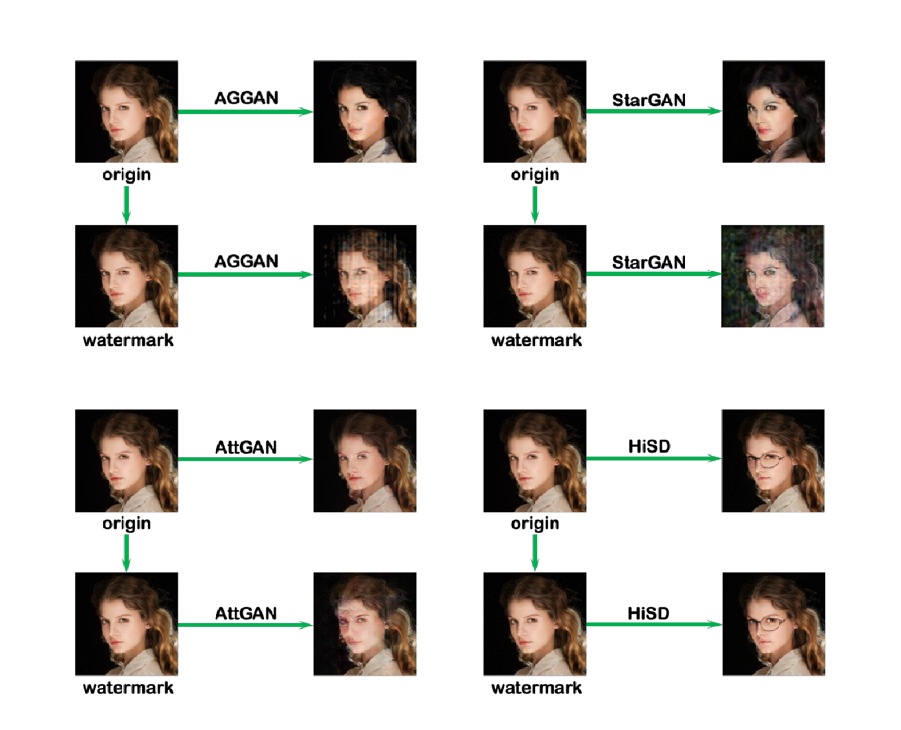

# SUA-Watermark: Scalable Universal Adversarial Watermark Defending Against Facial Forgery

This repository contains the **official implementation** of the paper:

> **Scalable Universal Adversarial Watermark Defending Against Facial Forgery**  
> *Authors: [Tong Qiao , Bin Zhao , Ran Shi , Meng Han , Senior Member, IEEE, Mahmoud Hassaballah , Senior Member, IEEE, Florent Retraint , and Xiangyang Luo]*  

---

## 🔥 Overview

We propose a **scalable universal adversarial watermark** designed to protect facial images against modern **facial forgery** and **deepfake generation** systems.  

Our watermark is:

- **Universal** — effective across diverse facial forgery models  
- **Scalable** — adapts to new forgery models without full retraining  
- **Imperceptible** — visually subtle yet highly robust  
- **Plug-and-Play** — compatible with any image and ready for practical deployment  
- **Model-Agnostic** — defends against various attack settings and GAN architectures  

---

## 📌 Features 

- Watermark generation (adversarial & scalable)
- Watermark embedding
- Evaluation scripts for deepfake generation robustness

---

## 🚀 Getting Started

### 1. Installation

```bash
git clone https://github.com/<yourname>/<repo>.git
cd SUA-Watermark

# Create a conda environment (recommended)
conda create -n SUA-Watermark python=3.9
conda activate SUA-Watermark

pip install -r requirements.txt
```

### 2. Prepare the dataset

Download the dataset from: https://pan.baidu.com/s/18cEQl_NIkyp86QcrwBmOVw?pwd=3hpd 

### 3. Prepare Model Weights

Download the weights from: https://pan.baidu.com/s/1e2rGnjEy0coP2KHpTK0aOg?pwd=eh85 

Place the `weights` folder in the root directory and run:

```
cd SUA-Watermark
mv weights/AttGAN/* AttGAN/output/
mv weights/stargan/* stargan
mv weights/AttentionGAN/* AttentionGAN/AttentionGAN_v1_multi/checkpoints
mv weights/HiSD/* HiSD
```

> ⚠️ Note: The weight files are owned by their respective authors. Commercial use requires authorization.

### 4. Training 

```shell
python universal_attack_expand.py
```

Modify model paths and weight settings in `settings.json` as needed.

### 5. Test on a Specific Image

```shell
python universal_attack_inference_one_image.py -i /path/to/image.jpg -o ./output_dir
```

---

## 🔬 Experimental Results



### 📄 Citation

If you find this work useful, please cite our paper: Scalable Universal Adversarial Watermark Defending Against Facial Forgery

```latex
@ARTICLE{10680120,
  author={Qiao, Tong and Zhao, Bin and Shi, Ran and Han, Meng and Hassaballah, Mahmoud and Retraint, Florent and Luo, Xiangyang},
  journal={IEEE Transactions on Information Forensics and Security}, 
  title={Scalable Universal Adversarial Watermark Defending Against Facial Forgery}, 
  year={2024},
  volume={19},
  number={},
  pages={8998-9011},
  keywords={Watermarking;Forgery;Predictive models;Generative adversarial networks;Computational modeling;Perturbation methods;Detectors;GAN forgery model;active defense;adversarial watermark;scalability},
  doi={10.1109/TIFS.2024.3460387}}
```


